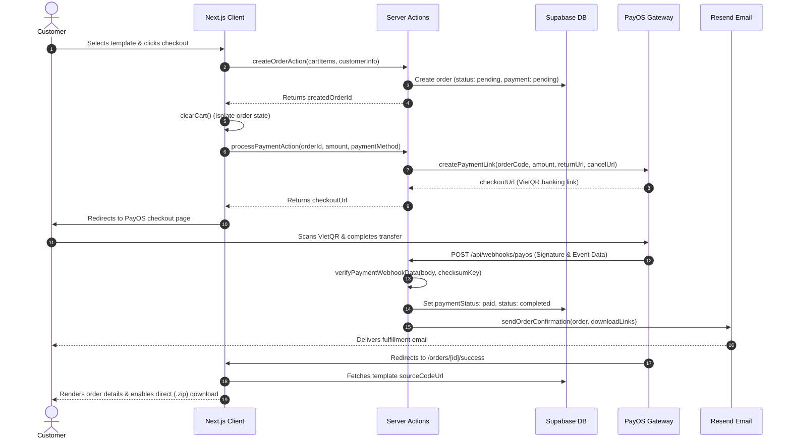

# KhoUI — Static Website Template & Theme Marketplace

> **Tóm tắt dự án**: KhoUI là nền tảng thương mại điện tử chuyên cung cấp các mẫu template website tĩnh (HTML5, CSS3, JavaScript, Bootstrap 5, Tailwind CSS) đóng gói trong file nén `.zip`. Hệ thống hỗ trợ xem thử trực tiếp trên nhiều kích thước màn hình, thanh toán tự động qua mã VietQR (PayOS) và cấp quyền tải tức thì. Ứng dụng được xây dựng theo kiến trúc Clean Architecture trên nền tảng Next.js 16 và Supabase.

<div align="center">
  

  <p>
    <a href="https://nextjs.org/"></a>
    <a href="https://react.dev/"></a>
    <a href="https://www.typescriptlang.org/"></a>
    <a href="https://tailwindcss.com/"></a>
    <a href="https://supabase.com/"></a>
    <a href="https://payos.vn/"></a>
  </p>
</div>

---

## Overview

**KhoUI** is an e-commerce platform designed to distribute standalone static website templates. Each template item consists of self-contained HTML5, CSS3, JavaScript, Bootstrap 5, or Tailwind CSS source files packaged in a `.zip` archive. 

Templates can be opened and tested directly in any modern browser without configuring server-side runtimes or databases, simplifying customization and static hosting integration.

---

## Demo & Screenshots

- **Live Demo**: <!-- TODO: Insert public production URL, e.g. https://khoui.io.vn -->
- **Admin Portal**: <!-- TODO: Insert demo admin link or testing credentials if available -->

| Storefront | Live Preview | Admin Dashboard |
| :---: | :---: | :---: |
| <!-- TODO: Add screenshot of homepage (e.g. ) --> | <!-- TODO: Add screenshot of template demo preview (e.g. ) --> | <!-- TODO: Add screenshot of admin dashboard (e.g. ) --> |

---

## Key Features

- **Static Template Packages (.zip)**: Catalog products are pure static files optimized for performance and responsive across Desktop, Tablet, and Mobile viewports.
- **Sandboxed Live Preview**: Embedded iframe viewer with URL sanitization and dynamic responsive viewport controls.
- **Automated VietQR Payments (PayOS)**: Generates banking QR payment links via PayOS, with asynchronous webhook verification and immediate digital download fulfillment.
- **Hybrid Dynamic Localization (i18n)**: English and Vietnamese language support combining compile-time dictionary files (`src/i18n/dictionaries/`) with runtime database overrides (`site_translations`) and an administrative 1-click sync action.
- **Feedback & Anti-Spam Controls**: Global route progress indicator and spinner states on interactive buttons to avoid duplicate submissions during async actions.
- **Layered Clean Architecture**: 4-layer structure (`Domain`, `Application`, `Infrastructure`, `Presentation`) with centralized Dependency Injection (`src/server/di/container.ts`), CWE-209 error sanitization, RFC 9116 `security.txt`, and strict Content-Security-Policy rules.
- **Admin Suite**: Administrative interface to upload templates, manage product categories, inspect real-time orders, and manage dictionary entries.

---

## Tech Stack

### Frontend
- **[Next.js 16](https://nextjs.org/)** (App Router, Turbopack, Server Actions)
- **[React 19](https://react.dev/)**
- **[Tailwind CSS 4](https://tailwindcss.com/)**
- **[Framer Motion](https://www.framer.com/motion/)** & **[GSAP](https://gsap.com/)**
- **[Zustand](https://github.com/pmndrs/zustand)**
- **[Lucide React](https://lucide.dev/)**
- **[Zod](https://zod.dev/)**

### Backend & Cloud Services
- **[Supabase](https://supabase.com/)** (PostgreSQL, Supabase Auth, Storage Buckets)
- **[PayOS](https://payos.vn/)** (VietQR payment gateway)
- **[Resend](https://resend.com/)** (Transactional fulfillment emails)
- **TypeScript 5**

---

## Payment Flow

The following sequence diagram outlines the transaction and fulfillment lifecycle:



---

## Project Structure

```
KhoUI/
├── src/
│   ├── server/             # Server-only execution
│   │   ├── domain/         # Pure entities, repository interfaces, Result<T, E>
│   │   ├── application/    # Core business use cases
│   │   ├── infrastructure/ # Supabase repositories, PayOS gateway, Resend email service
│   │   ├── presentation/   # Server actions ("use server") with CWE-209 sanitization
│   │   └── di/             # Composition Root (container.ts)
│   ├── client/             # Frontend UI presentation and client state
│   │   ├── components/     # UI components (storefront, admin, common, layout)
│   │   ├── hooks/          # Custom React hooks (useCart, useLocale, useToastStore)
│   │   └── stores/         # Zustand stores (cart, drawer, toast)
│   ├── shared/             # Shared contracts safe for client and server
│   │   ├── constants/      # Application constants, routes, navigation
│   │   ├── validations/    # Zod validation schemas
│   │   ├── utils/          # Formatting and utility functions
│   │   └── types/          # Shared DTOs and type definitions
│   ├── app/                # Next.js 16 App Router (pages, layouts, API routes)
│   └── i18n/               # Static dictionaries (vi.ts, en.ts) and localization helpers
├── public/                 # Static assets (LogoKhoUI.png, icons, .well-known/security.txt)
├── supabase/               # Stored procedures and schema migrations
└── .github/workflows/      # Automated CI workflow
```

---

## Development Workflow

The system architecture, database design, and business rules were designed and directed by the author. AI coding tools (Antigravity IDE & CLI) were utilized as programming assistants for code generation and refactoring, with all changes manually reviewed and verified. The workflow integrated Model Context Protocol (MCP) servers for Supabase, GitHub, Stitch, Vercel, and Chrome DevTools. Operational tracking is maintained in [`harness_execution.log`](harness_execution.log).

---

## Getting Started

### Prerequisites

- **Node.js**: `v20.9.0` or higher
- **Package Manager**: `npm`
- A **Supabase** project
- A **PayOS** merchant account (for VietQR processing)
- A **Resend** account (for transactional emails)

### Installation

1. **Clone the repository:**
   ```bash
   git clone https://github.com/NhinhoD/LuminaShop.git KhoUI
   cd KhoUI
   ```

2. **Install dependencies:**
   ```bash
   npm install
   ```

3. **Configure environment variables:**
   Copy the example environment template:
   ```bash
   cp .env.example .env.local
   ```
   Provide the required values in `.env.local`:

   | Variable | Scope | Description | Source |
   | :--- | :--- | :--- | :--- |
   | `SITE_URL` | Server | Canonical base URL for redirects and SEO | App domain (e.g. `http://localhost:3000`) |
   | `APP_URL` | Server | Secondary application URL fallback | App domain (e.g. `http://localhost:3000`) |
   | `NEXT_PUBLIC_SITE_URL` | Client & Server | Public base URL exposed to frontend | App domain (e.g. `http://localhost:3000`) |
   | `NEXT_PUBLIC_SUPABASE_URL` | Client & Server | Supabase project API URL | Supabase Dashboard > Settings > API |
   | `NEXT_PUBLIC_SUPABASE_ANON_KEY` | Client & Server | Supabase public anonymous API key | Supabase Dashboard > Settings > API |
   | `PAYOS_CLIENT_ID` | Server | PayOS payment integration client ID | PayOS Dashboard > API Credentials |
   | `PAYOS_API_KEY` | Server | PayOS payment integration API key | PayOS Dashboard > API Credentials |
   | `PAYOS_CHECKSUM_KEY` | Server | Secret key used to verify webhook signatures | PayOS Dashboard > API Credentials |
   | `RESEND_API_KEY` | Server | Resend API key for email delivery | Resend Dashboard > API Keys |
   | `RESEND_FROM_EMAIL` | Server | Sender address (must use verified domain) | e.g. `KhoUI <noreply@yourdomain.com>` |
   | `RESEND_REPLY_TO_EMAIL` | Server | Optional reply-to email address | e.g. `support@yourdomain.com` |

   > **Note on Resend**: In local development, if `RESEND_API_KEY` is omitted, the email service operates in safe mock mode without throwing fatal errors.

4. **Supabase Setup:**
   - **Database Tables & RPCs**: Execute SQL scripts located in `supabase/migrations/` using the Supabase SQL Editor.
   - **Storage Buckets**: In the Supabase Dashboard under Storage, create two public buckets:
     - `template-previews`: Stores unzipped static HTML/CSS files for the live demo iframe viewer.
     - `template-assets`: Stores template thumbnail images and full `.zip` source files.
   - **Seed Dictionary**: Navigate to `/admin/translations` and click **"Đồng bộ từ điển"** (Sync Dictionary) to populate initial localization keys from `vi.ts` into the `site_translations` table.

5. **PayOS Webhook Configuration (Local Testing):**
   - Start the local development server:
     ```bash
     npm run dev
     ```
   - Open a tunnel using ngrok:
     ```bash
     ngrok http 3000
     ```
   - In the PayOS Dashboard, configure the Webhook URL to:
     ```
     https://<your-ngrok-subdomain>.ngrok-free.app/api/webhooks/payos
     ```
   - Verify that `PAYOS_CHECKSUM_KEY` in `.env.local` matches the Webhook Checksum Key in the PayOS Dashboard.

---

## Quality Gates & Verification

The project includes an automated GitHub Actions workflow (`.github/workflows/ci.yml`) and manual verification scripts:

```bash
# Type-check codebase with TypeScript compiler
npx tsc --noEmit

# Check code style and rules via ESLint
npm run lint

# Run automated unit and integration tests (62 tests across 16 test suites)
npm test

# Build production bundle
npm run build
```

---

## Known Limitations & Roadmap

- **Initial Database Schema**: Baseline tables (`products`, `categories`, `orders`, etc.) are provisioned directly in Supabase; migrations in `supabase/migrations/` currently cover RPC functions and constraint patches.
- **PayOS Webhook on Localhost**: Requires an active reverse proxy tunnel (e.g. ngrok) to receive real-time webhook callbacks during local development.
- **Email Domain Verification**: Production transactional email delivery requires a custom domain verified in Resend.
- <!-- TODO: Add future roadmap items (e.g. customer product reviews, vendor portal, coupon/discount system) -->

---

## Author

Developed by **Phùng Dương** ([@NhinhoD](https://github.com/NhinhoD)).

- **GitHub**: [github.com/NhinhoD](https://github.com/NhinhoD)
- **Contact**: khoui.gmail@gmail.com

---

## License

This project is licensed under the terms specified in the [LICENSE](LICENSE) file. 
<!-- TODO: Please select and add your preferred license (e.g. MIT, Apache 2.0, or All Rights Reserved) -->
